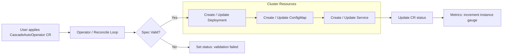

# CascadeAutoOperator

[](https://go.dev/)
[](https://kubernetes.io/)
[](LICENSE)
[](https://github.com/Randsw/k8s-operator-CascadeDeployment/actions)

A Kubernetes operator that automates the lifecycle of **Cascade Automation scenarios** — ordered sequences of processing modules that run as Jobs. Built with [Kubebuilder](https://book.kubebuilder.io/) and [`controller-runtime`](https://github.com/kubernetes-sigs/controller-runtime).

---

## Overview

The **CascadeAutoOperator** watches [`CascadeAutoOperator`](#cascadeautooperator) custom resources and reconciles them into a fully-configured Deployment, ConfigMap, and Service. Each Cascade scenario consists of one or more **CascadeModules** — processing steps with their own configuration and pod template. The operator serializes the scenario definition into a ConfigMap mounted into the workload pods, so the scenario controller inside the pod always has the latest configuration.

### What it manages

| Resource | Purpose |
|----------|---------|
| **Deployment** | Runs the scenario controller pods with the user-supplied template |
| **ConfigMap** | Holds the JSON-serialized `ScenarioConfig` mounted as a volume |
| **Service** | Exposes the scenario controller via a ClusterIP Service on port 80 → 8080 |

---

## Architecture



The controller uses [`controller-runtime`](https://pkg.go.dev/sigs.k8s.io/controller-runtime) with a [`GenerationChangedPredicate`](https://pkg.go.dev/sigs.k8s.io/controller-runtime/pkg/predicate#GenerationChangedPredicate) event filter to avoid unnecessary reconciles. Spec comparison uses [semantic deep-derivative equality](https://pkg.go.dev/k8s.io/apimachinery/pkg/api/equality#Semantic.DeepDerivative) to ignore API-server defaults.

---

## Custom Resources

### CascadeAutoOperator

The primary CR. Defines a cascade scenario — an ordered list of modules, a pod template for the scenario controller, and Deployment-level settings.

```yaml
apiVersion: cascade.cascade.net/v1alpha1
kind: CascadeAutoOperator
metadata:
  name: my-scenario
spec:
  replicas: 1
  scenarioconfig:
    cascademodules:
      - modulename: grayscale
        configuration:
          foo: bar
        template:
          spec:
            containers:
              - name: module-ctr
                image: my-module:latest
            restartPolicy: OnFailure
  template:
    spec:
      containers:
        - name: scenario-controller
          image: my-scenario:latest
          env:
            - name: SID
              value: "source-42"
      volumes:
        - name: config-volume
          configMap: {}
  strategy:
    type: RollingUpdate
```

**Key fields:**

| Field | Type | Description |
|-------|------|-------------|
| `spec.scenarioconfig.cascademodules` | `[]CascadeModule` | Ordered list of scenario modules (required, at least 1) |
| `spec.scenarioconfig.cascademodules[].modulename` | `string` | Unique name for the module (required) |
| `spec.scenarioconfig.cascademodules[].configuration` | `map[string]string` | Arbitrary key-value config for the module |
| `spec.scenarioconfig.cascademodules[].template` | `PodTemplateSpec` | Pod template for this module's Job |
| `spec.scenarioconfig.cascademodules[].activeDeadlineSeconds` | `*int64` | Max lifetime of the module Job |
| `spec.scenarioconfig.cascademodules[].backoffLimit` | `*int32` | Job retry limit (default: 6) |
| `spec.scenarioconfig.cascademodules[].ttlSecondsAfterFinished` | `*int32` | Auto-cleanup of finished Jobs |
| `spec.template` | `PodTemplateSpec` | Pod template for the scenario controller Deployment |
| `spec.replicas` | `int32` | Number of replicas (default: 1) |
| `spec.strategy` | `DeploymentStrategy` | Deployment update strategy |
| `spec.minReadySeconds` | `int32` | Min seconds before pod considered ready |
| `spec.revisionHistoryLimit` | `*int32` | Number of old ReplicaSets to retain (default: 10) |
| `spec.progressDeadlineSeconds` | `*int32` | Deployment progress deadline (default: 600s) |
| `spec.paused` | `bool` | Whether the deployment is paused |

**Status fields** (also shown as `kubectl get` columns):

| Column | Field | Description |
|--------|-------|-------------|
| Active Jobs | `status.active` | Number of ready replicas |
| Succeeded Jobs | `status.succeeded` | Count of succeeded Jobs |
| Failed Jobs | `status.failed` | Count of failed Jobs |
| Last Scenario Result | `status.result` | Status message (e.g. `reconciliation succeeded`) |

### CascadeRun

Tracks an individual cascade job execution. Used by the scenario controller to report results back.

```yaml
apiVersion: cascade.cascade.net/v1alpha1
kind: CascadeRun
metadata:
  name: run-abc123
spec:
  ob: "observer-id"
  src: "source-system"
  pid: "process-id"
  scenarioname: "my-scenario"
  modules:
    - grayscale
    - denoise
status:
  result:
    - "grayscale: OK"
    - "denoise: OK"
  info: "completed"
```

---

## Prerequisites

- **Go** 1.26+
- **Kubernetes** cluster 1.32+ (or [Kind](https://kind.sigs.k8s.io/) for local dev)
- **kubectl** configured to talk to your cluster
- **[Helm](https://helm.sh/)** 3.x (optional, for Helm-based deployment)
- **[Operator SDK](https://sdk.operatorframework.io/)** (optional, for OLM bundle workflows)

---

## Quick Start

### 1. Clone the repository

```bash
git clone https://github.com/Randsw/k8s-operator-CascadeDeployment.git
cd k8s-operator-CascadeDeployment
```

### 2. Install CRDs

```bash
make install
```

### 3. Deploy the operator

**Using Kustomize:**
```bash
make deploy IMG=ghcr.io/randsw/cascadeautooperator:latest
```

**Using Helm:**
```bash
helm upgrade --install cascade-auto-operator helm/cascade-auto-operator \
  --namespace cascade-system --create-namespace
```

### 4. Create a Cascade scenario

```bash
kubectl apply -f - <<EOF
apiVersion: cascade.cascade.net/v1alpha1
kind: CascadeAutoOperator
metadata:
  name: demo-scenario
spec:
  replicas: 1
  scenarioconfig:
    cascademodules:
      - modulename: hello-world
        configuration:
          message: "Hello from Cascade"
        template:
          spec:
            containers:
              - name: worker
                image: busybox:latest
                command: ["echo", "running"]
            restartPolicy: OnFailure
  template:
    spec:
      containers:
        - name: controller
          image: busybox:latest
          command: ["sleep", "infinity"]
      volumes:
        - name: config-volume
          configMap: {}
EOF
```

### 5. Verify

```bash
kubectl get cascadeautooperators
kubectl get deployments
kubectl get configmaps
kubectl get services
kubectl get cascaderuns
```

---

## Deployment Options

### Kustomize

| Command | Description |
|---------|-------------|
| `make install` | Install CRDs into the cluster |
| `make deploy` | Deploy the controller via Kustomize |
| `make undeploy` | Remove the controller |
| `make uninstall` | Remove CRDs |

### Helm Chart

The chart is located at [`helm/cascade-auto-operator/`](helm/cascade-auto-operator/). It includes:

- Operator Deployment with resource limits
- RBAC — ClusterRoles, ClusterRoleBindings, Roles, RoleBindings
- ServiceAccount for the operator and for scenario controller pods
- Prometheus ServiceMonitor support
- All CRDs packaged in `templates/crds/`

**Install:**
```bash
helm upgrade --install cascade-auto-operator helm/cascade-auto-operator \
  --namespace cascade-system --create-namespace \
  --set image.tag=v1.5.0
```

**Key values** (see [`values.yaml`](helm/cascade-auto-operator/values.yaml) for all options):

| Value | Default | Description |
|-------|---------|-------------|
| `replicaCount` | `1` | Number of operator replicas |
| `image.repository` | `ghcr.io/randsw/cascadeautooperator` | Container image repo |
| `image.tag` | `latest` | Image tag |
| `image.resources.limits.cpu` | `500m` | CPU limit |
| `image.resources.limits.memory` | `128Mi` | Memory limit |
| `serviceAccount.name` | `cascade-operator` | Operator SA name |
| `scenarioController.serviceAccount.name` | `cascade-scenario` | Scenario controller SA name |

### OLM Bundle

OLM bundle generation is supported via the Makefile:

```bash
make bundle IMG=ghcr.io/randsw/cascadeautooperator:v1.5.0
make bundle-build
make bundle-push
```

---

## Metrics

The operator exposes Prometheus metrics on `:8080/metrics`.

| Metric | Type | Description |
|--------|------|-------------|
| `cascadeauto_instance_current_count` | Gauge | Current number of CascadeAutoOperator instances being managed |

The gauge is incremented on successful Deployment creation and safely decremented via a finalizer when a CR is deleted — protecting against negative values with a mutex-guarded counter.

---

## Development

### Building

```bash
# Generate CRD manifests, RBAC, and deepcopy code
make generate
make manifests

# Build the binary
make build

# Run locally (requires cluster access)
make run
```

### Testing

```bash
# Run controller tests with envtest
make test
```

Tests use [Ginkgo](https://onsi.github.io/ginkgo/) + [Gomega](https://onsi.github.io/gomega/) and include:

- **Unit tests** — `labelsForCascadeAutoOperator`, `deploymentSpecEqual`, `serviceSpecEqual`, `validateSpec`
- **Integration tests** (envtest) — Full reconciliation of `CascadeAutoOperator` CRs, validation of Deployment/ConfigMap/Service creation, status updates, and spec change detection

### Docker image

```bash
# Build
make docker-build IMG=myregistry/cascadeautooperator:latest

# Push
make docker-push IMG=myregistry/cascadeautooperator:latest

# Multi-arch build
make docker-buildx IMG=myregistry/cascadeautooperator:latest
```

The [`Dockerfile`](Dockerfile) uses a multi-stage build: Go 1.26 builder → distroless static non-root image.

---

## CI/CD

Three GitHub Actions workflows automate the release pipeline:

| Workflow | Trigger | Purpose |
|----------|---------|---------|
| [`build.yaml`](.github/workflows/build.yaml) | Tag push (`*.*.*`) | Build multi-arch image, push to GHCR, create GitHub Release |
| [`test_release.yaml`](.github/workflows/test_release.yaml) | Push to `main` | Run Go tests and lint |
| [`helm-chart-test.yaml`](.github/workflows/helm-chart-test.yaml) | Push to `main` | Lint and test Helm chart with `chart-testing` |

---

## Project Structure

```
.
├── api/v1alpha1/                 # CRD type definitions
│   ├── cascadeautooperator_types.go  # CascadeAutoOperator + CascadeScenario types
│   └── jobrun_types.go               # CascadeRun type
├── config/
│   ├── crd/bases/                    # Generated CRD YAML manifests
│   ├── default/                      # Kustomize base for deploying the controller
│   ├── manager/                      # Controller manager Deployment manifest
│   ├── rbac/                         # RBAC manifests
│   └── samples/                      # Example CR YAML
├── controllers/
│   ├── cascadeautooperator_controller.go      # Main reconciliation logic
│   ├── cascadeautooperator_controller_test.go # Ginkgo test suite
│   └── suite_test.go                          # Test suite setup
├── helm/cascade-auto-operator/       # Helm chart
│   ├── templates/                    # Chart templates (Deployment, RBAC, CRDs)
│   └── values.yaml                   # Default values
├── monitoring/
│   └── metrics.go                    # Prometheus metrics registration
├── hack/                             # Code generation helpers
├── Dockerfile                        # Multi-stage container build
├── Makefile                          # Build, test, deploy targets
├── go.mod                            # Go module definition
└── main.go                           # Entrypoint — sets up controller-runtime manager
```

---

## License

Copyright 2022. Licensed under the Apache License, Version 2.0. See [LICENSE](LICENSE) for details.
